# Vue3 diff算法解析

## 1 前言

Vue作为业界优秀的开源框架, 同时也是业内广泛采用的技术方案, 其源码设计非常优秀。学习vue3源码有助于提高伙伴能力、拓展技术视野, 也能在实际的业务中帮助伙伴排查问题。

Diff算法是vue渲染器的一个重要组成部分, 解决了操作dom成本过高的问题。通过diff算法可以高效地实现渲染的局部更新, 避免dom全量更新带来的性能负担。在长列表、重渲染、重交互的场景, 伙伴可以借鉴diff算法的思想来提升渲染性能, 达到提升用户体验的目的。

本文目标是讲一下diff算法的实现方式, 吸收内部优秀的代码设计, 并将设计模式运用到实际业务中。本文主要讲述以下内容：

- 概述虚拟dom的概念
- 概述vue3的patch的概念
- 解析patchKeyedChildren的实现方式
- 解析patchUnkeyedChildren的实现方式
- 与vue2 diff的对比

## 2 背景

原生dom中有很多我们不需要的节点、属性, 因此在浏览器环境中进行dom的操作开销是很大的。 如果此时修改了部分数据, 直接渲染真实dom又会引起整个dom树的重绘和重排, 造成性能负担。

而diff算法就是我们解决操作真实dom成本过高的解决方案, 目的是计算出对于真实dom最小性能损耗的操作。

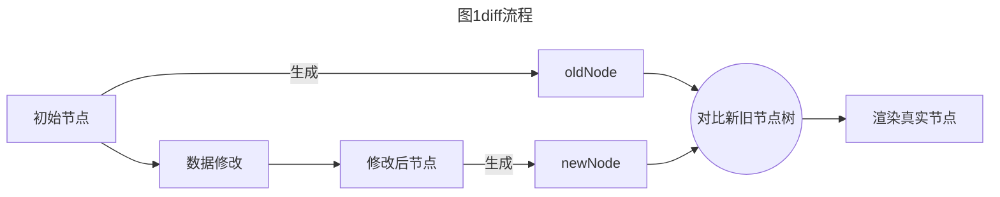

Diff算法是通过同层树节点进行比较的高效算法, 将前后两个模块的节点进行差异化比较, 并且不断修补、更新差异。如此避免了对树进行逐层搜索遍历, 所以渲染的效率更高。

## 3 源码解析

### 3.1 虚拟dom

在传统的页面开发中, 频繁变动dom会造成浏览器的**回流**或者**重绘**, 这种方式消耗计算资源较大。为了解决这个问题, 我们需要虚拟dom这一层抽象, 用对象的方式来描述真实的dom, 就能将性能消耗从真实dom操作的级别降低至JavaScript层面, 尽可能地一次性将差异更新到dom中, 这样我们就有更多的优化空间, 相对而言性能更加优秀。

不仅如此, 虚拟dom也能让**Vue**和**React**之类的框架支持除浏览器之外的其他平台(react native、uni-app、taro等跨平台框架)。

虚拟dom是一种对象结构, 它描述了每一层容器的特征, 其中包含了**type**、**props** 、**children**三个属性, 用来解释真实的dom节点。

```html
<div>
  <p id="vnode1">1</p>
  <p id="vnode2">2</p>
  <p id="vnode3">3</p>
  <p id="vnode4">4</p>
</div>
```

上面的HTML转换为虚拟dom如下：

```js
const vnode = {
  type: 'div',
  children: [
    {
      type: 'p',
      props: { 
        id: 'vnode1' 
      },
      key: '1',
      children: '1'
    }, 
    {
      type: 'p',
      props: {
        id: 'vnode2'
      },
      key: '2',
      children: '2'
    },
    {
      type: 'p',
      props: {
        id: 'vnode3'
      },
      key: '3',
      children: '3'
    }, {
      type: 'p',
      props: {
        id: 'vnode4'
      },
      key: '4',
      children: '4'
    }]
}
```

如果需要把HTML的结构改变为如下结构：

```html
<div>
  <p id="vnode4">4</p>
  <p id="vnode1">1</p>
  <p id="vnode2">2</p>
  <p id="vnode3">3</p>
</div>
```

传统的方式会导致整个dom树的重绘和重排, 但分析结构可以得出结论：**把节点4移动到头部就是最小损耗的操作, 这就是diff算法需要做的事**。

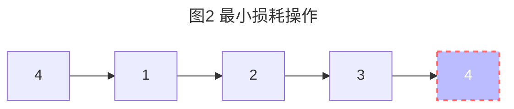

### 3.2 Diff过程

#### 3.2.1 节点判断

在采取diff算法比较新旧节点的时候, 比较只会在同层级进行, 因为复杂度过高, 不会跨层级比较。

```html
<div>
  <p>123</p>
</div>

<div>
  <span>456</span>
</div>
```

上面的代码会分别比较同一层的两个div以及第二层的p和span , 但是不会拿div和span作比较。

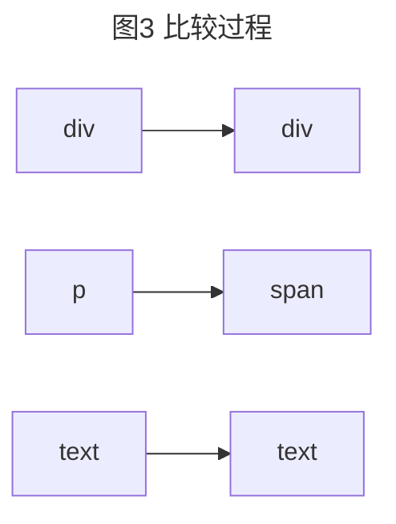

如何判断是否是同一个节点呢？在vue中**isSameVNodeType函数就是用来区分是相同节点的方式**, 通过节点的**type**和**key**值两个维度可以快速判断两个节点是否相同。

```ts
function isSameVNodeType(n1: VNode, n2: VNode): boolean {
  return n1.type === n2.type && // 比较类型
         n1.key === n2.key  // 比较标记
}
```

#### 3.2.2 patch过程

首先要从patch函数开始看起。Vue在通过VNode节点渲染dom时, 并不是通过当前的VNode节点去暴力的更新dom节点, 而是对新旧两个VNode节点通过patch进行比较, 然后通过对比结果找出差异的属性或节点进行按需更新。

patch的过程中主要完成以下几件事情：

- 创建需要新增的节点
- 移除已经废弃的节点
- 移动或修改需要更新的节点

```js
const patch = (n1, n2, container, anchor = null, parentComponent = null, parentSuspense = null, isSVG = false, slotScopeIds = null, optimized = isHmrUpdating ? false : !!n2.dynamicChildren) => {
  /**
    Vnode有不同的类型, 可以分为：
    简单类型：文本、注释、Static。
    复杂类型：组件、Fragment、Component、Teleport、Suspense。
    patch思路, 可以看作一个深度优先遍历。
    简单类型就相当于JS中的原始数据类型：字符串、数字、布尔。
    复杂类型就相当于JS中的引用类型：对象、数组、Map、Set。
    不同的节点类型, 需要采取不同的patch方式。
    而patch函数的主要职责就是去判断Vnode的节点类型(打上patchFlag标志), 然后调用对应类型的Vnode处理方式, 进行更细致的patch(最后进行render渲染)。
*/
  if (n1 === n2) {
    return;
  }
  // patching & not same type, unmount old tree
  if (n1 && !isSameVNodeType(n1, n2)) {
    anchor = getNextHostNode(n1);
    unmount(n1, parentComponent, parentSuspense, true);
    n1 = null;
  }
  if (n2.patchFlag === -2 /* BAIL */) {
    optimized = false;
    n2.dynamicChildren = null;
  }
  const { type, ref, shapeFlag } = n2;
  switch (type) {
    case Text:
      // 文本类型的处理...
      processText(n1, n2, container, anchor);
      break;
    case Comment:
      processCommentNode(n1, n2, container, anchor);
      break;
    case Static:
      // 静态类型的处理...
      if (n1 == null) {
        mountStaticNode(n2, container, anchor, isSVG);x
      }
      else {
        patchStaticNode(n1, n2, container, isSVG);
      }
      break;
    case Fragment:
      // Fragment 类型处理
      processFragment(n1, n2, container, anchor, parentComponent, parentSuspense, isSVG, slotScopeIds, optimized);
      break;
    default:
      if (shapeFlag & 1 /* ELEMENT */) {
        // ELEMENT 类型处理
        processElement(n1, n2, container, anchor, parentComponent, parentSuspense, isSVG, slotScopeIds, optimized);
      }
      else if (shapeFlag & 6 /* COMPONENT */) {
        // 组件 类型处理
        processComponent(n1, n2, container, anchor, parentComponent, parentSuspense, isSVG, slotScopeIds, optimized);
      }
      else if (shapeFlag & 64 /* TELEPORT */) {
        // 节点移动 类型处理
        type.process(n1, n2, container, anchor, parentComponent, parentSuspense, isSVG, slotScopeIds, optimized, internals);
      }
      else if (shapeFlag & 128 /* SUSPENSE */) {
        // 节点移动 类型处理
        type.process(n1, n2, container, anchor, parentComponent, parentSuspense, isSVG, slotScopeIds, optimized, internals);
      }
      else {
        warn('Invalid VNode type:', type, `(${typeof type})`);
      }
  }
  // set ref
  if (ref != null && parentComponent) {
    setRef(ref, n1 && n1.ref, parentSuspense, n2 || n1, !n2);
  }
};
```

patch函数的核心处理逻辑如下图所示：

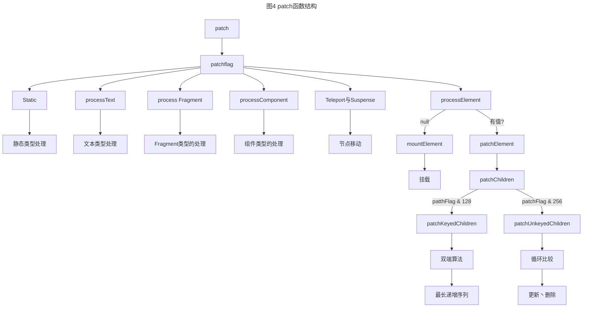

**patch函数的主要职责就是判断Vnode的节点类型(打上patchFlag标志), 然后调用对应类型的Vnode处理方式, 进行更细致的patch(最后进行render渲染)**。

其中patchFlag用于标识编译优化信息, 可以理解为对虚拟节点VNode的属性进行描述的标志。根据patchFlag判断出需要更新的内容, 实现靶向更新。

patchFlag类型如下：

```ts
export const enum PatchFlags {
  // 表示vnode具有动态textContent的元素
  TEXT = 1,
  // 表示vnode具有动态的class
  CLASS = 1 << 1,
  // 表示具有动态的style
  STYLE = 1 << 2,
  // 表示具有动态的非class和style的props
  PROPS = 1 << 3,
  // 表示props具有动态的key, 与CLASS、STYLE、PROPS冲突
  FULL_PROPS = 1 << 4,
  // 表示有监听事件(在同构期间需要添加)
  HYDRATE_EVENTS = 1 << 5,
  // 表示vnode是个children顺序不会改变的fragment
  STABLE_FRAGMENT = 1 << 6,
  // 表示children带有key的fragment
  KEYED_FRAGMENT = 1 << 7,
  // 表示children没有key的fragment
  UNKEYED_FRAGMENT = 1 << 8,
  // 表示vnode只需要非props的patch。例如只有标签中只有ref或指令
  NEED_PATCH = 1 << 9,
  // 表示vnode存在动态的插槽。例如动态的插槽名
  DYNAMIC_SLOTS = 1 << 10,
  // 表示用户在模板的根级别存在注释而创建的片段, 这是一个仅用于开发的标志, 因为注释在生产中被剥离
  DEV_ROOT_FRAGMENT = 1 << 11,
  // 以下都是一些特殊的flag, 它们不能使用位运算进行匹配
  // 表示vnode经过静态提升
  HOISTED = -1,
  // diff算法应该退出优化模式
  BAIL = -2
}
```

Vue3中通过patch函数生成出一个数字枚举来对虚拟节点进行标记, 采用按位与(&)运算来确定节点的属性, 比如文本节点、数组节点、组件节点等等, CPU中有直接对应位操作的指令, 提升判断效率。

到patch函数匹配类型为复杂类型时, 正式进入我们的diff算法的详细处理流程。主要处理两种情况：

- **有key的处理,  进入patchKeyedChildren流程**
- **无key的处理,  进入patchUnkeyedChildren流程**

```js
const patchChildren = (n1, n2, container, anchor, parentComponent, parentSuspense, isSVG, slotScopeIds, optimized = false) => {
  const c1 = n1 && n1.children;
  const prevShapeFlag = n1 ? n1.shapeFlag : 0;
  const c2 = n2.children;
  const { patchFlag, shapeFlag } = n2;
  // fast path
  // 这个 patchFlag, 就是一个判断渲染的节点上是包含 key 的一个标识符
  if (patchFlag > 0) {
    if (patchFlag & 128 /* KEYED_FRAGMENT */) {
      // 当节点上面存在 key, 执行的是 patchKeyedChildren 方法
      // this could be either fully-keyed or mixed (some keyed some not)
      // presence of patchFlag means children are guaranteed to be arrays
      patchKeyedChildren(c1, c2, container, anchor, parentComponent, parentSuspense, isSVG, slotScopeIds, optimized);
      return;
    }
    else if (patchFlag & 256 /* UNKEYED_FRAGMENT */) {
      // 当前节点上不存在 key, 执行的是 patchUnkeyedChildren 方法
      // unkeyed
      patchUnkeyedChildren(c1, c2, container, anchor, parentComponent, parentSuspense, isSVG, slotScopeIds, optimized);
      return;
    }
  }
}
```

- **有key的处理**

主要分为五个部分：首遍历、尾遍历、旧节点挂载完毕、新节点挂载完毕、皆有剩余, 接下来我们依次来看。

- **首遍历**

```js
/* 从头对比找到有相同的节点 patch , 发现不同, 立即跳出*/
while (i <= e1 && i <= e2) {
  const n1 = c1[i];
  const n2 = (c2[i] = optimized
              ? cloneIfMounted(c2[i])
              : normalizeVNode(c2[i]));
  // isSameVNodeType 根据type与key的维度判断同一节点
  if (isSameVNodeType(n1, n2)) {
    // 相同就打补丁
    patch(n1, n2, container, null, parentComponent, parentSuspense, isSVG, slotScopeIds, optimized);
  }
  else {
    // 不相同就跳出
    break;
  }
  // 记录下标
  i++;
}
```

这一步是diff的第一步, 是从节点组头部向尾部遍历, 如果遍历过程中遇到相同节点, 就进行patch, 否则就退出遍历, 并记录当前遍历的最新下标。

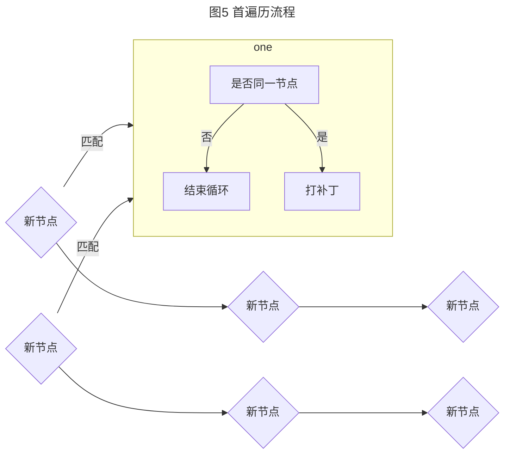

- 尾遍历

```js
 /* 从尾部对比找到有相同的节点 patch , 发现不同, 立即跳出*/
while (i <= e1 && i <= e2) {
  const n1 = c1[e1];
  const n2 = (c2[e2] = optimized
              ? cloneIfMounted(c2[e2])
              : normalizeVNode(c2[e2]));
  // isSameVNodeType 根据type与key的维度判断同一节点
  if (isSameVNodeType(n1, n2)) {
    // 相同就打补丁
    patch(n1, n2, container, null, parentComponent, parentSuspense, isSVG, slotScopeIds, optimized);
  }
  else {
    // 不相同就跳出
    break;
  }
  // 记录下标
  e1--;
  e2--;
}
```

第二步和第一步类似, 是从后向前遍历, 如果遇到第一步记录的下标就停止；遍历过程中, 如果遇到相似节点也是直接进行patch对比, 如果不相同就是直接退出遍历, 并且记录旧节点组和新节点组的尾指针。

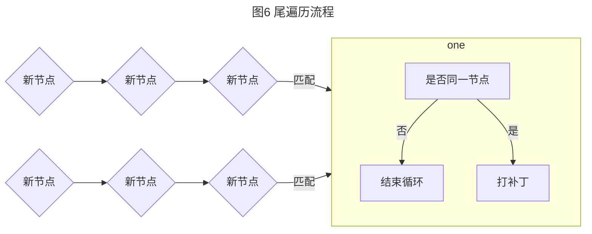

- 旧节点挂载完毕

```js
/* 如果新的节点大于老的节点数 , 对于剩下的节点全部以新的vnode处理( 这种情况说明已经patch完相同的vnode  ) */
if (i > e1) {
  if (i <= e2) {
    const nextPos = e2 + 1;
    const anchor = nextPos < l2 ? c2[nextPos].el : parentAnchor;
    while (i <= e2) {
      /* 创建新的节点*/
      patch(null, (c2[i] = optimized
                   ? cloneIfMounted(c2[i])
                   : normalizeVNode(c2[i])), container, anchor, parentComponent, parentSuspense, isSVG, slotScopeIds, optimized);
      i++;
    }
  }
}
```

旧节点挂载完毕代表只有新的节点剩余, 执行旧节点**挂载**。

- 新节点挂载完毕

```js
// 只有旧的节点剩余
else if (i > e2) {
  while (i <= e1) {
    // 执行旧节点卸载
    unmount(c1[i], parentComponent, parentSuspense, true);
    i++;
  }
}
```

新节点挂载完毕代表只有旧的节点剩余, 执行旧节点**卸载**。

- **皆有剩余**

```js
// 5. unknown sequence
// [i ... e1 + 1]: a b [c d e] f g
// [i ... e2 + 1]: a b [e d c h] f g
// i = 2, e1 = 4, e2 = 5
else {
  const s1 = i; // prev starting index
  const s2 = i; // next starting index
  // 5.1 build key:index map for newChildren
  // 生成一个 Map 把新的元素的 key(如果存在) 和它对应的下标保存起来。
  const keyToNewIndexMap = new Map();
  for (i = s2; i <= e2; i++) {
    const nextChild = (c2[i] = optimized
                       ? cloneIfMounted(c2[i])
                       : normalizeVNode(c2[i]));
    if (nextChild.key != null) {
      if (keyToNewIndexMap.has(nextChild.key)) {
        warn(`Duplicate keys found during update:`, JSON.stringify(nextChild.key), `Make sure keys are unique.`);
      }
      keyToNewIndexMap.set(nextChild.key, i);
    }
  }
  // 5.2 loop through old children left to be patched and try to patch
  // matching nodes & remove nodes that are no longer present
  let j;
  let patched = 0; // 已经patch完的数量
  const toBePatched = e2 - s2 + 1; // 需要patch的数量,即c2剩下的元素数量
  let moved = false; // 是否需要进行移动操作
  // used to track whether any node has moved
  let maxNewIndexSoFar = 0; // 用来辅助判定moved
  // 生成c2中剩下的元素,在c1中的原来的位置的对应数组, 初始化都为0
  // 数组长度为 toBePatched, 即剩下的 c2 中的元素数量
  // 比如 oldchildren = [a, b, (c, d, e, f,) g, h], 
  // newchildren = [a, b, (d, e, f, c,) g, h]
  // d 在 new 中 index 为 2, 在 old 中为 3
  const newIndexToOldIndexMap = new Array(toBePatched);
  for (i = 0; i < toBePatched; i++)
    newIndexToOldIndexMap[i] = 0;
  for (i = s1; i <= e1; i++) {
    const prevChild = c1[i];
    if (patched >= toBePatched) {
      // all new children have been patched so this can only be a removal
      unmount(prevChild, parentComponent, parentSuspense, true);
      continue;
    }
    let newIndex;
    // 寻找 key 是否存在
    if (prevChild.key != null) {
      newIndex = keyToNewIndexMap.get(prevChild.key);
    }
    else {
      // 如果没有 key 就在 c2 剩下的元素中 寻找同样没有 key 且, 还没有配对的元素
      for (j = s2; j <= e2; j++) {
        if (newIndexToOldIndexMap[j - s2] === 0 &&
            isSameVNodeType(prevChild, c2[j])) {
          newIndex = j;
          break;
        }
      }
    }
    // 如果 newindex 不存在, 说明 child 在 c2 中不存在, 卸载就行了
    if (newIndex === undefined) {
      unmount(prevChild, parentComponent, parentSuspense, true);
    }
    else {
      // 如果存在, 找到对应的位置
      newIndexToOldIndexMap[newIndex - s2] = i + 1;
      if (newIndex >= maxNewIndexSoFar) {
        maxNewIndexSoFar = newIndex;
      }
      else {
        moved = true;
      }
      patch(prevChild, c2[newIndex], container, null, parentComponent, parentSuspense, isSVG, slotScopeIds, optimized);
      // 比较新老元素
      patched++;
    }
  }
  // 5.3 move and mount 最长递增子序列
  const increasingNewIndexSequence = moved
    ? getSequence(newIndexToOldIndexMap)
    : shared.EMPTY_ARR;
  j = increasingNewIndexSequence.length - 1;
  for (i = toBePatched - 1; i >= 0; i--) {
    const nextIndex = s2 + i;
    const nextChild = c2[nextIndex];
    // 找到元素要移动的位置节点
    const anchor = nextIndex + 1 < l2 ? c2[nextIndex + 1].el : parentAnchor;
    if (newIndexToOldIndexMap[i] === 0) {
      // 新元素没有在 c1 中匹配到index 新建就行了
      patch(null, nextChild, container, anchor, parentComponent, parentSuspense, isSVG, slotScopeIds, optimized);
    }
    else if (moved) {
      // move if:
      // 最大子序列下标中 对应的元素不需要移动, 其他的元素要进行move
      // 如果 i 对应的不是最长子序列中的下标 进行move移动元素
      if (j < 0 || i !== increasingNewIndexSequence[j]) {
        move(nextChild, container, anchor, 2 /* REORDER */);
      }
      else {
        j--;
      }
    }
  }
}
```

如果新旧节点组都未遍历完, 说明存在未知序列可能存在位移等情况。

这个节点就要引入vue3最核心的思想：**最长递增子序列**。

在vue3中最长递增序列是基于旧节点列表key值映射到新节点列表的最长递增子序列, 求解出不需要移动的元素有哪些, 以此为基准操作其他节点移动、新增、删除。

我们看一个例子：首先我们需要知道老节点与新节点下标的排序，假如：

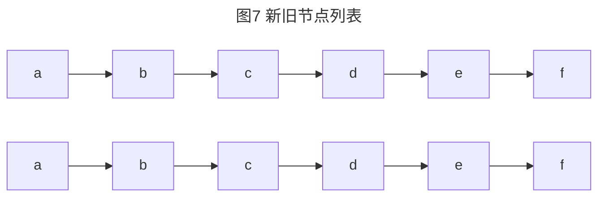

oldVNodes: [0,1,2,3,4,5]；newVNodes: [0,3,1,2,4,5]

得出最长递增子序列为[1,2]，然后可以在移动老节点的时候，忽略掉 [1,2]这些元素而不去移动他们，这就是损耗最小的移动方式。

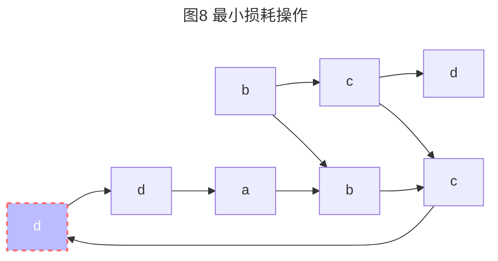

核心实现：

```js
function getSequence(arr) {
  const p = arr.slice();
  const result = [0]; // 保存最长递增子序列的索引  以默认第0个位基准
  let i, j, u, v, c;
  const len = arr.length;
  for (i = 0; i < len; i++) {
    // 【1】 找到索引先放进去
    const arrI = arr[i];
    if (arrI !== 0) {
      j = result[result.length - 1]; // 找到序列中的最后一项
      if (arr[j] < arrI) { // 取出序列中的最后一项对应的值 与当前项的值相比较
        p[i] = j; // 当前一项
        result.push(i); // 记录索引
        continue;
      }
      // 【2】 二分查找 在结果集中找到比当前值大的 用当前值的索引将其替换掉
      // result是递增序列 采用二分查找是最快的
      u = 0;
      v = result.length - 1; // 二分查找 前后索引
      while (u < v) { // 最终 start = end 就停止了
        c = (u + v) >> 1;
      // 拿result中间值 和 当前项 比较
        if (arr[result[c]] < arrI) { // 找比arrI大的值 或者等于arrI
          u = c + 1;
        }
        else {
          v = c;
        }
      }
      if (arrI < arr[result[u]]) { // 当前项小于中间值就替换掉大的那一项
        if (u > 0) { // end > 0 才需要替换 p[i]就是当前一项
          p[i] = result[u - 1]; // 【3.3】替换并记录前驱节点，核心点：记录 “要替换的值的 前一个的索引”
        }
        result[u] = i;
      }
    }
  }
  u = result.length;
  v = result[u - 1];
  // 倒序追溯 根据前驱节点一个个向前查找
  while (u-- > 0) {
      result[u] = v; // 最后一项肯定是正确的
      v = p[v]; // 重新赋值
  }
  return result;
}
```

实现原理：

- **通过贪心+二分查找拿到数组索引列表**

1. 旧的VNode数大于新的VNode数，卸载多余节点。
2. 先创建一个空数组result保存索引
3. 遍历nums，将当前项current和result的最后一项对应的值进行比较
4. 如果当前项大于最后一项，直接往result中新增一项
5. 否则，针对result数组进行二分查找，找到并替换比当前项大的那项

下方示意图中为了方便理解result存放的是nums中的值，实际代码存放的是数组索引。

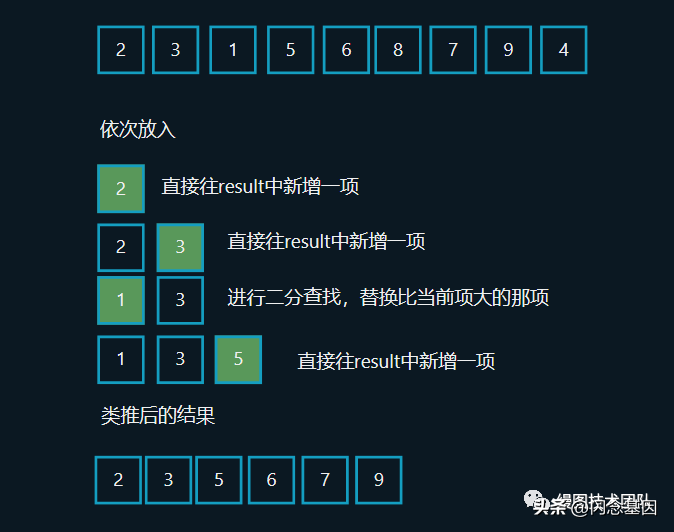

**通过前驱节点重建列表**

再创建一个数组preIndexArr。在步骤1往result中新增或者替换新值的时候，同时preIndexArr新增一项，该项为当前项对应的前一项的索引，这样我们有了两个数组：

```js
const result = [1, 3, 4, 6, 7, 9]
const preIndexArr = [undefined, 0, undefined, 1, 3, 4, 4, 6, 1]
```

Result的结果是不准确的，但是result的最后一项是正确的，因为最后一项是最大的。由此可得，最大一项是值9，索引是7。可查询preIndexArr[7]获得9的前一项的索引为6，值为7，依次类推能够重建新的result。

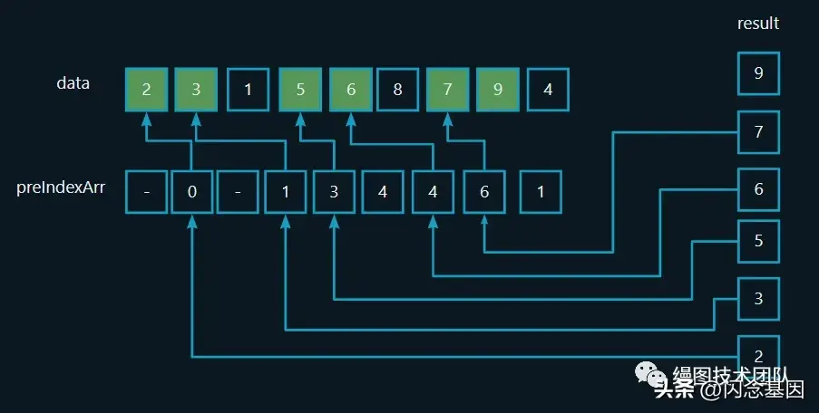

这样我们就得到了最长递增子序列，此时只需要以此序列为基准，移动在序列外的元素，达到节省性能的目的。因此，**递增序列越长时，vue3的性能优势越显著**，这样就完成了**PatchKeyedChildren**比较的过程。

- 无key的处理

源码实现：

```js
const patchUnkeyedChildren = (c1, c2, container, anchor, parentComponent, parentSuspense, isSVG, slotScopeIds, optimized) => {
  c1 = c1 || shared.EMPTY_ARR;
  c2 = c2 || shared.EMPTY_ARR;
  const oldLength = c1.length;
  const newLength = c2.length;
  const commonLength = Math.min(oldLength, newLength);
  let i;
  // 每次比对新旧节点会调用patch方法
  // 该方法的执行流程是：
  // 1. 如果两个节点一样不做处理
  // 如果节点不同就更新
  for (i = 0; i < commonLength; i++) {
    const nextChild = (c2[i] = optimized
                       ? cloneIfMounted(c2[i])
                       : normalizeVNode(c2[i]));
    patch(c1[i], nextChild, container, null, parentComponent, parentSuspense, isSVG, slotScopeIds, optimized);
  }
  if (oldLength > newLength) {
    // 卸载多余节点
    // remove old
    unmountChildren(c1, parentComponent, parentSuspense, true, false, commonLength);
  }
  else {
    // 创建多余节点
    // mount new
    mountChildren(c2, container, anchor, parentComponent, parentSuspense, isSVG, slotScopeIds, optimized, commonLength);
  }
};
```

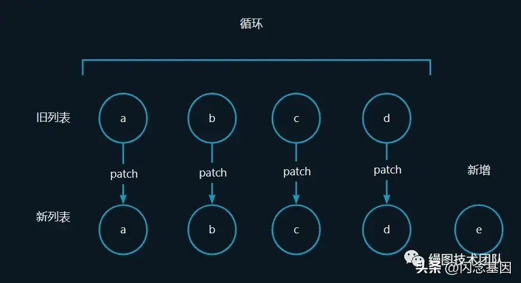

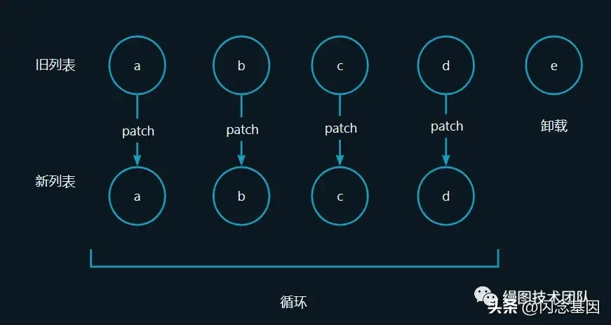

含有key属性主要用patchKeyedChildren策略进行新旧节点对比。如果不使用key，vue会使用一种最大限度减少动态元素并且尽可能的尝试就地修改/复用相同类型元素的策略。

**Diff流程：**

- 获取旧的和新的VNode数组（列表）的长度
- Math.min（c1.length,c2.length）获取新旧数组中长度最短的值，然后遍历短的VNode列表
- 相同的就不更新，不同的就更新
- 直到遍历完成：

1. 旧的VNode数大于新的VNode数，卸载多余节点
2. 新的VNode数小于新的VNode数，创建多余节点

这样就完成了**patchUnkeyedChildren**比较的过程。

#### 3.2.3 与vue2 diff的对比

- vue2核心diff算法采用的是**双端比较算法**

1. 双端指针头尾比较
2. 剩余节点**旧列表**删除或**新列表**添加

- vue3核心diff算法采用的是**去头尾的最长递增子序列算法**

4. 双端指针头尾比较
5. 最长递增序列

Vue2、vue3的diff算法实现差异主要体现在：**处理完首尾节点后，对剩余节点的处理方式**。

Vue2是通过对旧节点列表建立一个 `{key, oldVnode}` 的映射表，然后遍历新节点列表的剩余节点，根据newVnode.key在旧映射表中寻找可复用的节点，然后打补丁并且移动到正确的位置。

Vue3则是建立一个存储新节点数组中的剩余节点在旧节点数组上的索引的映射关系数组，建立完成这个数组后也即找到了可复用的节点，然后通过这个数组计算得到最长递增子序列，这个序列中的节点保持不动，将新节点数组中的剩余节点移动到正确的位置。

## 4 业务思考

### 4.1 不推荐使用index作为key的原因

在开发中，经常出现警告不要用index作为key，经过前面对源码的学习我们已经得到答案了。

- 若**对数据进行逆序添加、逆序删除等破坏顺序的操作**，会出现数组下标变化的场景，index的变化会导致vue认为是同一节点，**导致更新异常**
- 若不存在对数据逆序添加、逆序删除等破坏顺序的操作，则没有问题

**根据上述问题，我们自然也找到了解决方法：唯一的ID作为key**

### 4.2 patchflag优化判断性能

Vue3采用了位运算优化判断性能，因CPU中有直接对应位操作的指令，可以提升判断效率更，在遇到大量判断的场景，我们可以借鉴**patchflag**的解决方案。

```js
let skills = 0;
const SKILLS = {
 CSS: 1 ,
 JS: 1 << 1,
 HTML: 1 << 2,
 WEB_GL: 1 << 3
}
skills = skills | SKILLS.JS;
if (skills & SKILLS.JS) {
  // CODE
}
```

### 4.3 最长递增序列的应用场景

举一个我之前做相册的排序功能的实际例子：每张照片都有一个index属性，假设有4张照片，排序时第一张照片挪到最后的情况，排序前：1,2,3,4；排序后：2,3,4,1

最简单最笨的方式是要修改四张照片的index值：1->4 , 2->1 , 3->2, 4->3；最优解应该是只修改第一张照片index值：1->5（假设修改一次index是有成本，修改越少次越好）

这个例子是肉眼可见的能找到最优解，但是当数据量大，排序后比较混乱的时候，就不那么容易找到最优解了。这个时候如果你曾经接触过算法，你很容易联想到这个问题跟最长公共子序列算法要解决的场景非常契合。

## 5 总结

Diff算法是vue用于解决数据更新时操作dom成本过高的解决方案，当数据更新时，用于确定最优的更新视图的策略。Diff在有key时使用了**双指针+最长递增子序列实现**，复杂度为**O(nlogn)**；diff在没有key时会**找到短列表比较**，再执行**新增或删除**，复杂度为O(n)。

相比于vue2的双端比较算法，两者的实现差异主要体现在：处理完首尾节点后，对剩余节点的处理方式，**vue3 diff相比vue2性能更好，在递增序列越长时越显著**。

最后，我们在一起回顾一下diff算法的知识点:

- **What**：diff算法是一种对新旧虚拟DOM树进行比较，得出两者差异，确定最优的更新视图的策略算法
- **Why**：减少渲染真实dom的开销，提高性能
- **When**：页面更新，重新渲染时用到
- **Where**：Vue中，当数据发生改变时，set方法会调用Dep.notify通知所有订阅者
- **Watcher**，订阅者就会调用patch给真实的dom打补丁
- **Who**：Vue（patch、patchKeyedChildren、patchUnkeyedChildren）
- **How**：深度优先、同层比较；tag不同，生成树形结构不同；使用key来标识稳定节点