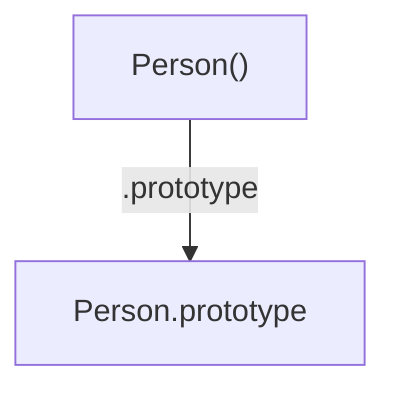
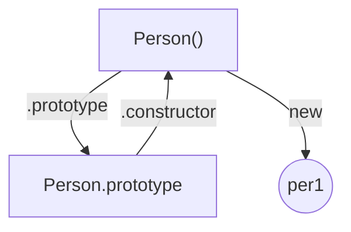
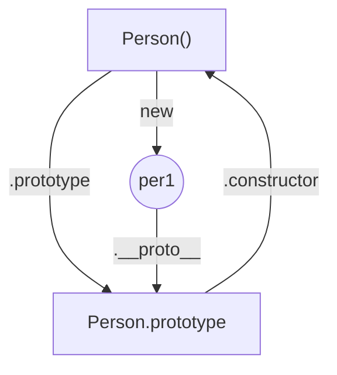
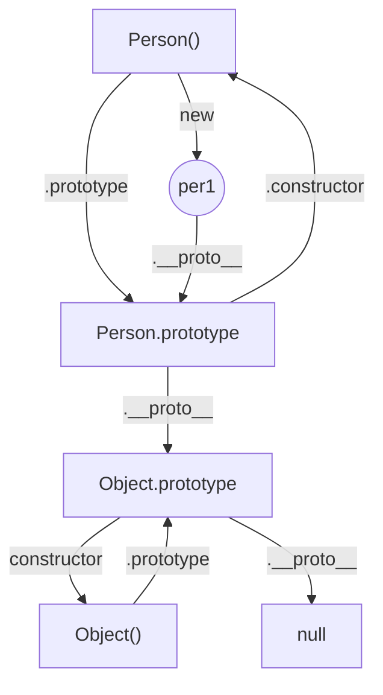
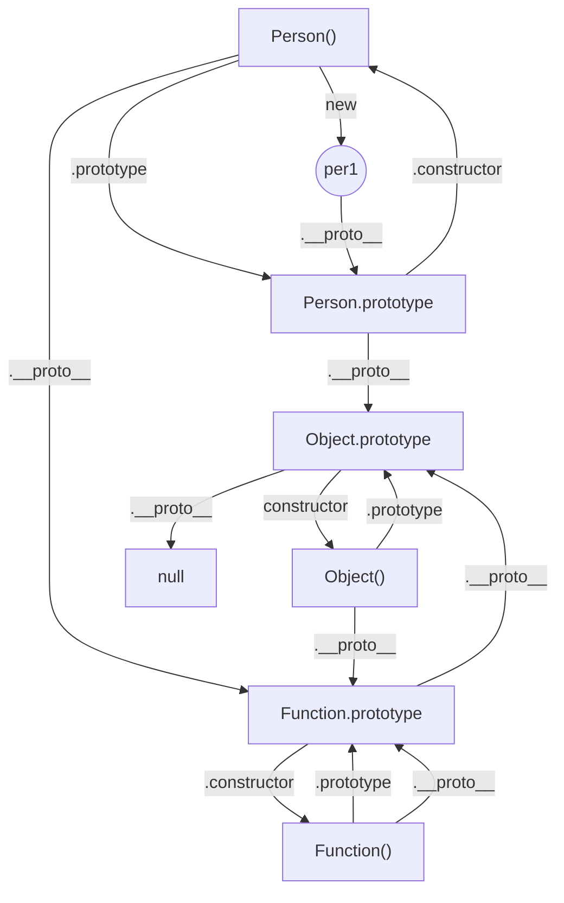

# Js原型和原型链

## 1.前言

在JavaScript中，原型和原型链是一个很重要的知识点，只有理解了它，我们才能更深刻的理解JavaScript，在这里，我们将分成几个部分来逐步讲解。

## 2.构造函数

构造函数和普通函数本质上没什么区别，只不过使用了new关键字创建对象的函数，被叫做了构造函数。构造函数的首字母一般是大写，用以区分普通函数，当然不大写也不会有什么错误。

```js
function Person(name, age) {
  this.name = name;
  this.age = age;
  this.species = '人类';
  this.say = function () {
    console.log("Hello");
  }
}

let per1 = new Person('xiaoming', 20);
```

## 3.原型对象

在JavaScript中，每一个函数类型的数据，都有一个叫做prototype的属性，这个属性指向的是一个对象，就是所谓的原型对象。



对于原型对象来说，它有个constructor属性，指向它的构造函数。



那么这个原型对象有什么用呢？最主要的作用就是用来存放实例对象的公有属性和公有方法。

在上面那个例子里species属性和say方法对于所有实例来说都一样，放在构造函数里，那每创建一个实例，就会重复创建一次相同的属性和方法，显得有些浪费。这时候，如果把这些公有的属性和方法放在原型对象里共享，就会好很多。

```js
function Person(name, age) {
  this.name = name;
  this.age = age;
}

Person.prototype.species = '人类';
Person.prototype.say = function () {
  console.log("Hello");
}

let per1 = new Person('xiaoming', 20);
let per2 = new Person('xiaohong', 19);

console.log(per1.species); // 人类 
console.log(per2.species); // 人类

per1.say(); // Hello
per2.say(); // Hello
```

可是这里的species属性和say方法不是实例对象自己的，为什么可以直接用点运算符访问？这是因为在js中，对象如果在自己的这里找不到对应的属性或者方法，就会查看构造函数的原型对象，如果上面有这个属性或方法，就会返回属性值或调用方法。所以有时候，我们会用per1.constructor查看对象的构造函数：

```js
console.log(per1.constructor); // Person()
```

这个constructor是原型对象的属性，在这里能被实例对象使用，原因就是上面所说的。那如果原型对象上也没有找到想要的属性呢？这就要说到原型链了。

## 4.原型链

说原型链之前，先来了解两个概念：

### 4.1 显示原型

显示原型就是利用`prototype`属性查找原型，只是这个是函数类型数据的属性。

### 4.2 隐式原型

隐式原型是利用`__proto__`属性查找原型，这个属性指向当前对象的构造函数的原型对象，这个属性是对象类型数据的属性，所以可以在实例对象上面使用

```js
console.log(per1.__proto__ === Person.prototype); // true
console.log(per2.__proto__ === Person.prototype); // true
```

根据上面，就可以得出`constructor`、`prototype`和`__proto__`之间的关系了：



### 4.3 原型链

既然这个是对象类型的属性，而原型对象也是对象，那么原型对象就也有这个属性，但是原型对象的`__proto__`又是指向哪呢？

我们来分析一下，既然原型对象也是对象，那我们只要找到对象的构造函数就能知道`__proto__`的指向了。而js中，对象的构造函数就是`Object()`，所以对象的原型对象，就是`Object.prototype`。既然原型对象也是对象，那原型对象的原型对象，就也是`Object.prototype`。不过`Object.prototype`这个比较特殊，它没有上一层的原型对象，或者说是它的`__proto__`指向的是null。


所以上面的关系图可以拓展成下面这种：



到这里，就可以回答前面那个问题了，如果某个对象查找属性，自己和原型对象上都没有，那就会继续往原型对象的原型对象上去找，这个例子里就是`Object.prototype`，这里就是查找的终点站了，在这里找不到，就没有更上一层了（`null`里面啥也没有），直接返回`undefined`。

可以看出，整个查找过程都是顺着`__proto__`属性，一步一步往上查找，形成了像链条一样的结构，这个结构，就是原型链。所以，原型链也叫作隐式原型链。

正是因为这个原因，我们在创建对象、数组、函数等等数据的时候，都自带一些属性和方法，这些属性和方法是在它们的原型上面保存着，所以它们自创建起就可以直接使用那些属性和方法。

## 5.函数也是一种对象

函数在js中，也算是一种特殊的对象，所以，可以想到的是，函数是不是也有一个`__proto__`属性？答案是肯定的，既然如此，那就按上面的思路，先来找找函数对象的构造函数。

在JavaScript中，所有函数都可以看做是`Function()`的实例，而`Person()`和`Object()`都是函数，所以它们的构造函数就是`Function()`。`Function()`本身也是函数，所以`Function()`也是自己的实例，听起来既怪异又合理，但是就是这么回事。

```js
console.log(Person.constructor === Function); // true
console.log(Object.constructor === Function); // true
console.log(Function.constructor === Function); // true
```

既然知道了函数的构造函数，那么函数的`__proto__`指向我们也就知道了，就是`Function.prototype`。

```js
console.log(Person.__proto__ === Function.prototype); // true
console.log(Object.__proto__ === Function.prototype); // true
console.log(Function.__proto__ === Function.prototype); // true
```

根据这几个结论，我们就能拓展出一张更大的关系图了：



## 6.总结

构造函数是使用了new关键字的函数，用来创建对象，所有函数都是`Function()`的实例 原型对象是用来存放实例对象的公有属性和公有方法的一个公共对象，所有原型对象都是`Object()`的实例 原型链又叫隐式原型链，是由`__proto__`属性串联起来，原型链的尽头是`Object.prototype`