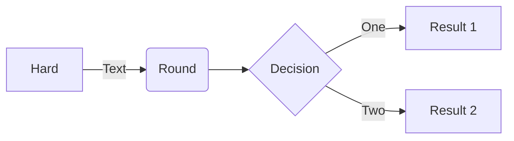
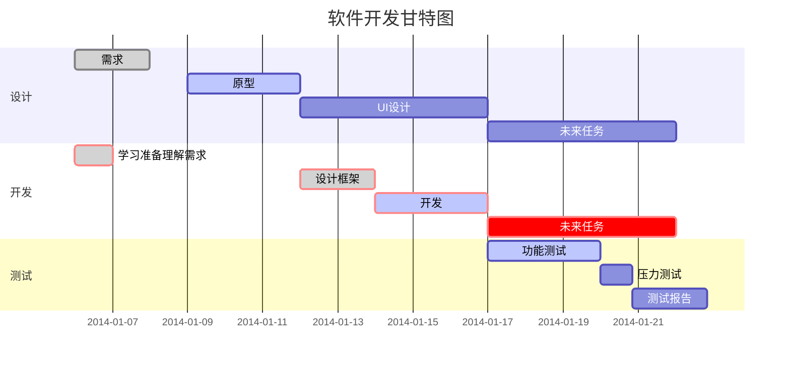
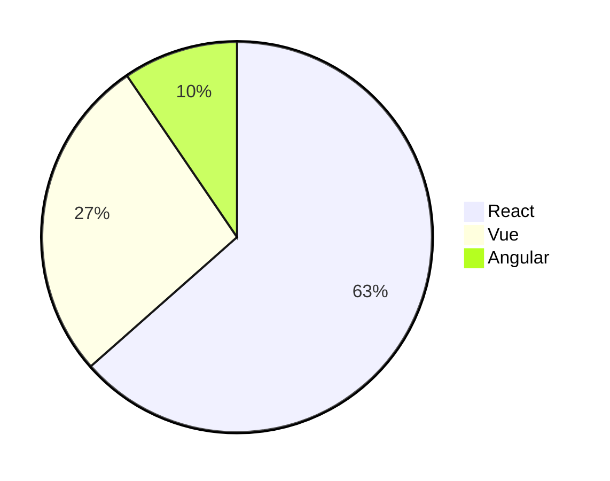

# Markdown语法

## 字体效果

### 斜体

语法:

```tex
*斜体文本*

_斜体文本_
```

*斜体文本*

_斜体文本_

---

### 加粗

语法:

```tex
**加粗文本**
```

**加粗文本**

---

### 删除文本

语法:

```tex
~~删除文本~~
```

~~删除文本~~

---

### 标记文本

语法:

```tex
==标记文本==
```

<output>
  <mark>标记文本</mark>
</output>

---

### 上标

语法:

```tex
这是^上标^
```

<output>
  这是<sup>上标</sup>
</output>

---


### 下标

语法:

```tex
这是~下标~
```

<output>
  这是<sub>下标</sub>
</output>

---

## 标题

```tex
# 一级标题
## 二级标题
### 三级标题
#### 四级标题
##### 五级标题
###### 六级标题
```

---

## 链接

```tex
[链接名称](url)
```

---

## 图片

```tex

```

**带链接的图片**

```tex
[](url)
```

---

## 分割线

```tex
***

---

___
```

---

## 引用

```tex
> 引用的文本
```

>引用的文本

---

## 列表

### 无序列表

语法:

```tex
- 1
	- 1-1 
- 2
	- 2-1
		- 2-1-1
- 3
```

- 1
	- 1-1 
- 2
	- 2-1
		- 2-1-1
- 3

### 有序列表

语法:

```tex
1. 苹果
   1. 红苹果
2. 香蕉
   1. 熟香蕉
      1. 唔熟
   2. 生香蕉
3. 橙子
```

1. 苹果
   1. 红苹果
2. 香蕉
   1. 熟香蕉
      1. 唔熟
   2. 生香蕉
3. 橙子

---

## 表格

```tex
|表头1|表头2|
|:---|:---|
|内容1|内容2|
```

|表头1|表头2|
|:---|:---|
|内容1|内容2|


设定内容居中、居左、居右

使用`:---:`居中

使用`:---`居左

使用`---:`居右

```tex
|表头1|表头2|表头3|
|:---:|:---|---:|
|内容1|内容2|内容3|
```

|表头1|表头2|表头3|
|:---:|:---|---:|
|内容1|内容2|内容3|

---

## 注脚

```tex
一个文本(有注脚)[^1]

<!-- 文末添加 -->
[^1]: 注脚的解释
```

---

## 待办事项

```tex
- [ ] 未完成的任务
- [x] 完成的任务
	- [ ] 任务2-1
```

- [ ] 未完成的任务
- [x] 完成的任务
	- [ ] 任务2-1

---

## 代码块

语法:

````tex
```js
console.log('测试');
```
````

>js可以是其他编程语言，例如java, python, php

```js
console.log('测试');
```


### 行内代码

语法:

```tex
`console.log('测试')`
```

输出:

`console.log('测试')`

---

## 数学公式

Markdown Preview Enhanced使用[KaTex](https://katex.org/)或者[MathJax](https://www.mathjax.org/)来渲染数学表达式

KaTeX 拥有比 MathJax 更快的性能，但是它却少了很多 MathJax 拥有的特性。你可以查看 KaTeX supported functions/symbols 来了解 KaTeX 支持那些符号和函数。

```tex
$$
  f(x) = sin(x) + 12
$$
```

---

## 画图

### 流程图

````tex

````


### 甘特图

````tex

````


### 饼图

````tex

````


---


## html

### 键盘码

语法:

```html
使用 <kbd>Ctrl</kbd>+<kbd>Alt</kbd>+<kbd>Del</kbd> 重启电脑
```
